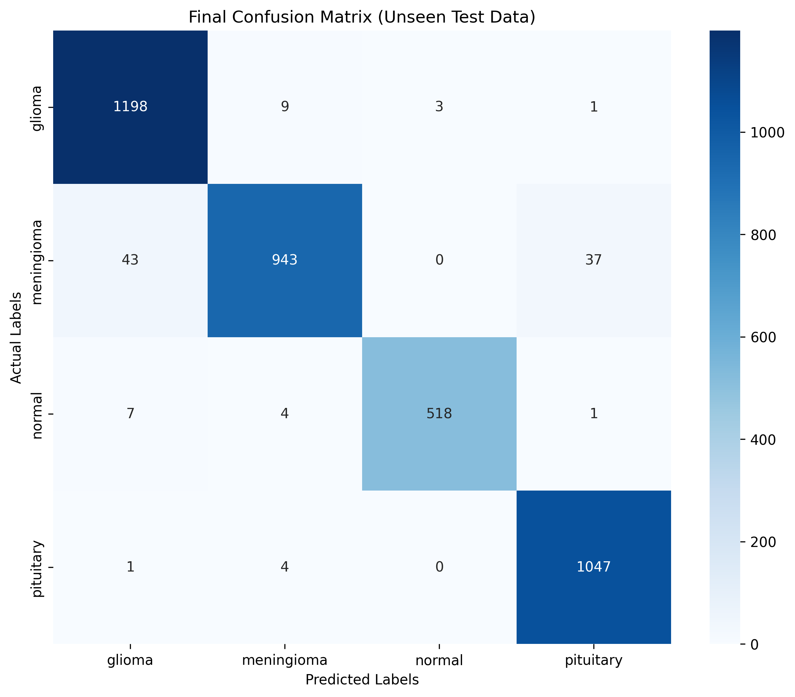
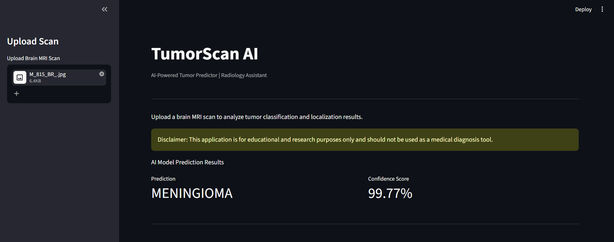
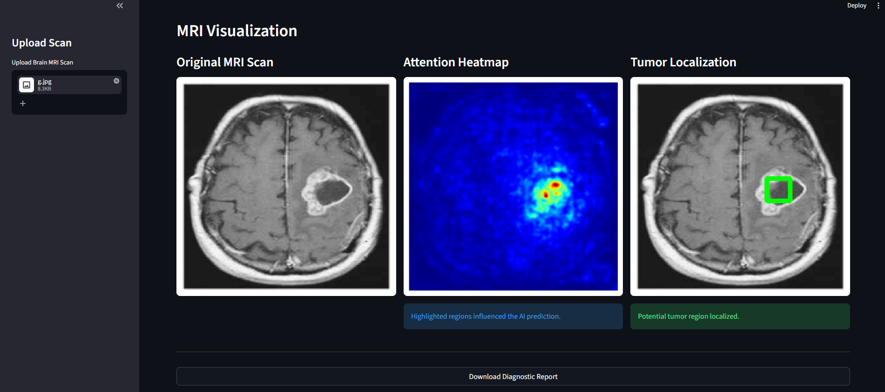
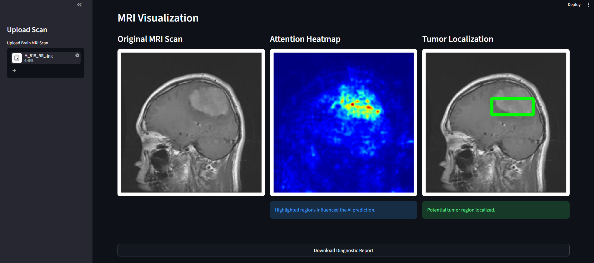
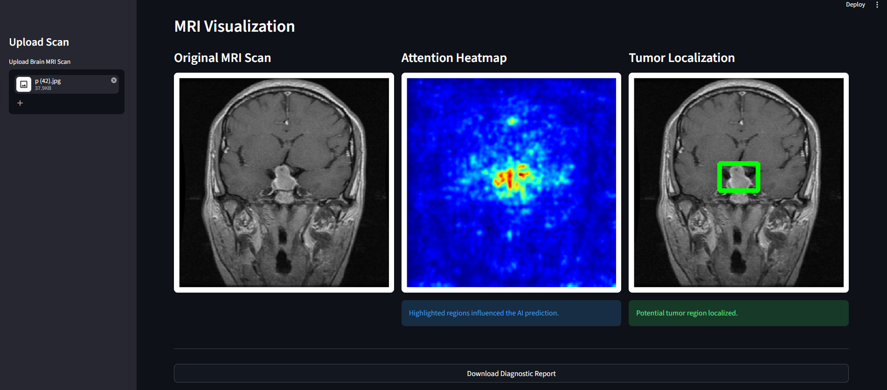
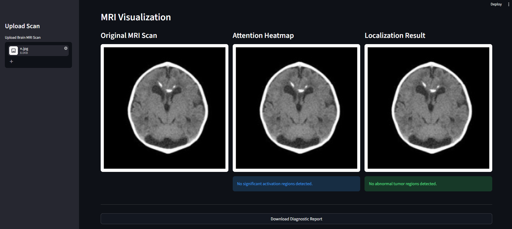

# Brain Tumor Classification using Deep Learning

This project is a brain tumor classifier built using a deep learning model (EfficientNetB0 CNN), trained into a custom AI model that predicts brain tumors based on MRI scans.

- Glioma
- Meningioma
- Pituitary
- Normal (No Tumor)

---

## Features

- **Four-Class Detection:** Classifies scans into `glioma`, `meningioma`, `normal`, and `pituitary`.
- **High Performance:** Achieves **97.22% test accuracy** using an optimized deep neural network.
- **Dynamic Learning Rate:** Uses `ReduceLROnPlateau` to improve convergence and stabilize training.
- **Best Model Checkpointing:** Automatically saves the best model based on validation accuracy.
- **User Interface:** Simple web-based UI for uploading MRI scans, getting instant predictions, and generating diagnostic reports.

---

## Model Performance

The model was trained for 50 epochs and showed strong learning ability with high generalization performance.

### Training Highlights
- **Best Validation Accuracy:** 97.28% (reached at Epoch 44)
- **Final Test Accuracy:** **97.22%**

### Classification Report

The model shows consistently high precision, recall, and F1 scores across all classes, indicating strong and balanced performance.

```text
              precision    recall  f1-score   support

     glioma       0.96      0.99      0.98      1211
 meningioma       0.98      0.92      0.95      1023
    notumor       0.99      0.98      0.99       530
  pituitary       0.96      1.00      0.98      1052
```

### Confusion Matrix

The high concentration of numbers along the dark blue diagonal proves that the model consistently predicts the correct tumor type with very few mistakes across all classes, proving the 97% accuracy on the unseen test data.



---

## User Interface & Results

Here is how the application predicts and classifies brain MRI scans for each category:

### Main Page


---

*The model correctly identifies each type of brain tumor by detecting abnormal tissue patterns in the MRI scan.*

### Glioma Prediction Result


### Meningioma Prediction Result


### Pituitary Prediction Result


---

*The model correctly classifies scans with no abnormalities as normal MRI scans.*

### Normal (No Tumor) Prediction Result


---

## Tech Stack & Architecture

This project uses deep learning and computer vision to build an end-to-end brain tumor classification system.

### Core Technologies
- **Programming Language:** Python
- **Deep Learning Framework:** TensorFlow, Keras (EfficientNetB0 CNN)
- **Computer Vision:** OpenCV, Pillow (PIL)
- **Web Interface:** Streamlit
- **Data Processing & Evaluation:** NumPy, Scikit-learn
- **Visualization:** Matplotlib, Seaborn

---